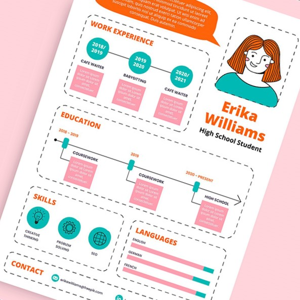

<<<<<<< HEAD
# This is Project and Makes Resume

## It Uses AI To Enhance Your Resume
=======

# AI-Powered Resume Builder



## 🚀 Overview
The **AI-Powered Resume Builder** simplifies the process of creating professional resumes with AI-enhanced content suggestions. Users can fill out a form, preview different resume templates, and generate PDF/DOCX files—all in one seamless experience.

## ✨ Features
- 📝 **AI-powered field suggestions** for better resume content.
- 🎨 **Multiple resume templates** stored in the backend.
- 👁️ **Real-time preview modal** to view and switch templates.
- 📂 **Download resumes as PDF/DOCX**.
- 🔄 **LocalStorage support** to remember user selections.
- 🔗 **Seamless navigation** between form, preview, and download.

## 🏗️ Tech Stack
- **Frontend**: React (Redux Toolkit & Context API for state management)
- **Backend**: Node.js, Express (Handles AI and resume template storage)
- **Database**: MongoDB (For storing user-generated resumes, if needed)
- **Styling**: Tailwind CSS

## 📂 Project Structure
```
resume-builder/
├── backend/                   # API for AI suggestions & templates
├── frontend/
│   ├── src/
│   │   ├── components/        # Reusable UI components
│   │   ├── pages/             # Resume form, preview, etc.
│   │   ├── assets/            # Static images like resumeBg.jpg
│   ├── public/
│   │   ├── resumeBg.jpg       # Background image for UI
├── package.json               # Project dependencies
├── README.md                  # Documentation
```

## 🔧 Installation & Setup

1️⃣ Clone the repository:
```sh
 git clone https://github.com/yourusername/resume-builder.git
 cd resume-builder
```

2️⃣ Install dependencies:
```sh
 npm install  # For frontend
 cd backend && npm install  # For backend
```

3️⃣ Start the project:
```sh
 npm run dev  # Runs frontend and backend concurrently
```

## 📸 Screenshots
### Home Page


### Resume Preview Modal
(Include a screenshot here)

## 📜 License
This project is open-source under the MIT License.

---
💡 *Contributions, feedback, and feature suggestions are welcome!* 🚀
>>>>>>> develop

## It Creates resume of multiple templates